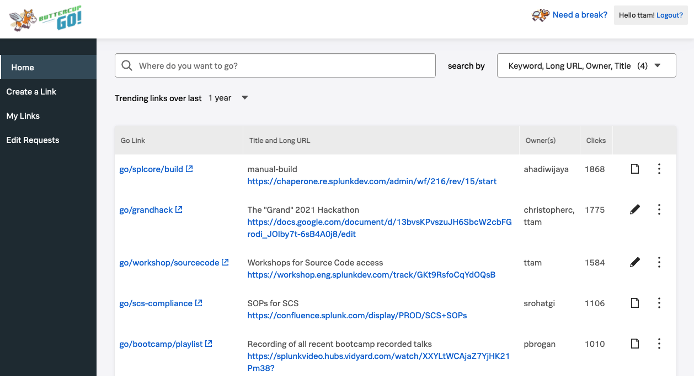
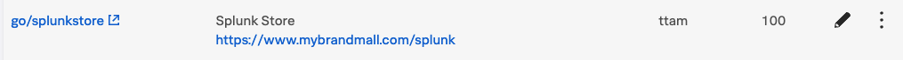
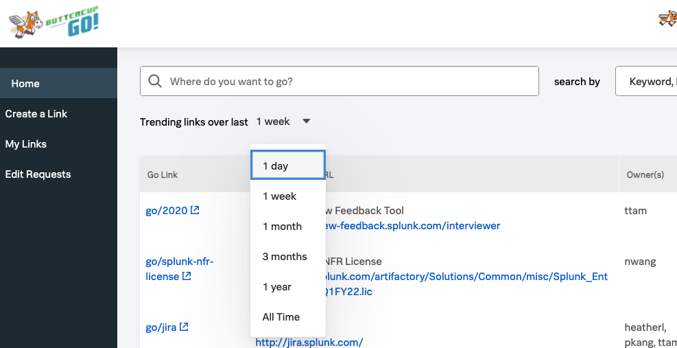
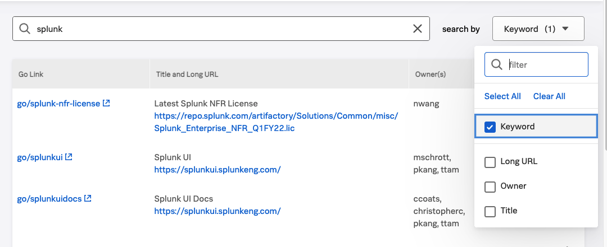

# Searching for GO Links
Searching for links starts at http://go.splunk.com or simply http://go/

## Homepage
1. Login to VPN first (http://go/ is behind our firewall)
2. Open your browser to http://go/ 
   * If this opens up `go.com`, make sure to type `http` once to seed your browser
3. You should see a screen below

## Basics of search
1. Start typing what you are looking for
   * Some examples are `rsu` `okr` `espp` `bootcamp`
2. The search results are sorted by the number of clicks by other Splunkers
3. If you find a link that is interesting, ex: `splunkstore`, click on the `go/[splunkstore]` on *Go Link* column.
   * 

## Browsing
You can go to the homepage (http://go/) and discover what others are clicking on daily, weekly or monthly to discover interesting content

1. From the homepage, select the *Trending links over last* drop down
2. Select *1 month*
3. You will see the list of links created over the last month sorted by the number of clicks

## Advance searching
By default, search will search on the *keyword*, *Long URL*, *title* and *owner*.  When you are seeing too many results, you can narrow down your search to only one of these field

1. Let's say you want to find only the short keyword with the word **splunk**
2. Click on the *search by* drop down
3. Clear All
4. Select *Keyword*
5. Type `splunk` in the search field

